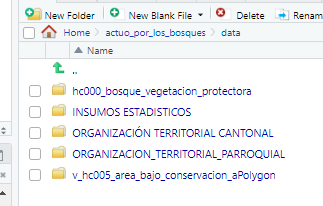

# Reto: Actua por los bosques

## Evento: Data Jam 2da. edición, 2023

Herramienta para evaluar la localización actual de puestos de control forestal.

Antes

El reto se ha realizado en la siguiente versión de R

    major          4                                
    minor          2.3  

Para poder generar realizar el análisis se tomaron los siguientes pasos:

-   Creación de un repositorio en GitHub

-   Actua por los bosques (Solución equipo: foRestEC)

-   Los scripts y resultados se pueden observar en el este repositorio GitHub .

-   Creación de un proyecto de R

-   Definición del directorio data/ para almacenar los archivos en los computadores locales.

-   La descarga de los datos brindados se realizo a través del siguiente enlace:

-   Descarga de insumos para Data Jam 2023

-   Revisión de los contenidos de los cada archivo. Se notó que teniamos archivos en formato .xlsx (en el caso de las matrices temáticas) y .zip (para los shapefiles), para los segundos fue necesario descargarlos y descomprimirlos.

Nuestro repositorio quedo de la siguiente manera:

Contenido del proyecto

                                  |

Con estos pasos, procedimos a tener una conversación en el grupo para ver qué variables eran de interés y cuáles podían servir para responder las preguntas sobre las estaciones en los distintos puntos del país. Debido a la gran cantidad de información decidimos abarcar la pertinencia de los puestos forestales de control desde tres aristas:

-   Aprovechamiento del recurso forestal

-   Datos sobre la atención a denuncias

-   Datos los controles realizados en los puntos de control de acuerdo al origen y destino del recurso forestal.

Durante

En la etapa previa, se utilizó los recursos de datos en cuanto a la información geográfica para examinar diversos aspectos relacionados con los recursos forestales: puestos de control de recursos madereros y no madereros, las denuncias atendidas en cuanto al volumen de retención y los controles realizados al recurso forestal de acuerdo al origen y al destino de estos recursos.

Con los recursos señalados y las variables de interés vamos a calcular los agregados que debido a su pertinencia nos permitan evaluar el estado de los puntos de control. Para cada una de las fuentes en mención se siguió el siguiente proceso:

-   Limpieza de las cabeceras de las bases de datos

-   Agrupación de la matriz al nivel geográfico más detallado y posible en la fuente de información.

-   Cálculo del indicador:

-   Conteo de número de revisiones realizados en los puntos de control a los recursos forestales de acuerdo al origen y destino del recurso forestal

-   Áreas de los predios y destinadas a programas forestales

-   Número de denuncias realizadas en cada parroquia y valor retenido en cada parroquia del recurso forestal

-   Creación de variables de unión en cada fuente para graficar la información de los indicadores en las capas geográficas.

-   Unión de las tablas de resumen con el diccionario pertinente a la división geográfica.

Este proceso de los recursos permitió obtener una visión más completa de la situación de los bosques y los recursos forestales, así como de las denuncias relacionadas.

Nuestro objetivo es aportar a la representación gráfica de la pertinencia de los puntos de control forestal así como ayudar a la comprensión de la distribución espacial de los recursos, identificar áreas críticas o en riesgo, optimizar la ubicación de los puestos de control y mejorar la gestión y protección de los bosques.

Después

Empezamos con la creación de una historia. En nuestro caso los personajes de nuestra historia serán los puestos de control fijo. Decidimos generar 6 gráficos: Distribución geográfica de puestos fijos y áreas vulnerables, aprevechamiento del recurso forestal aprobado y efectivo, volumen verificado y retenido en los puestos fijos de control, controles y denuncias realizadas en los cantones y puestos fijos. En todos los casos replicamos la misma estructura de código y comentarios detallada a contnuación:

-   Integración de la tabla de indicadores a la capa geográfica manteniendo el formato sf

-   Creación de capas con ggplot()

-   Visualización del coroplético

-   Visualización de areas vulnerables

-   Visualización de puestos de control

-   Ajuste de parametros en cada capa

-   Definición del formato de salida

-   Inclusión de leyendas

Con esto concluimos el procesamiento realizado para nuestro análisis, el resultado lo pueden observar en el siguiente enlace:

<https://ergostats.github.io/actuo_por_los_bosques/>
